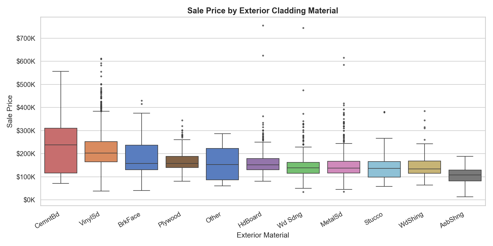
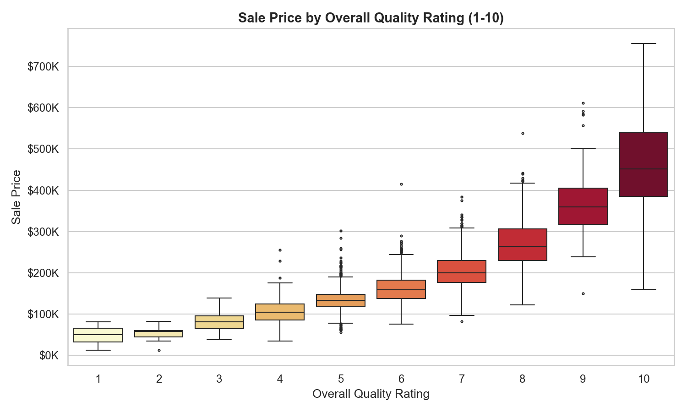
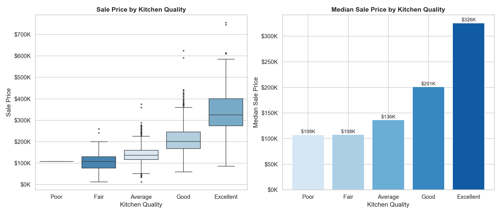
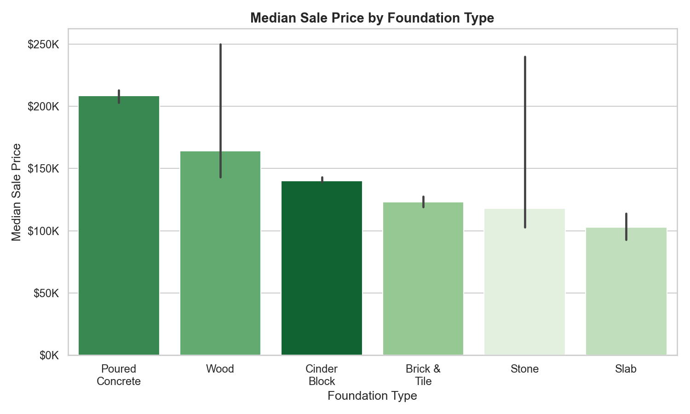
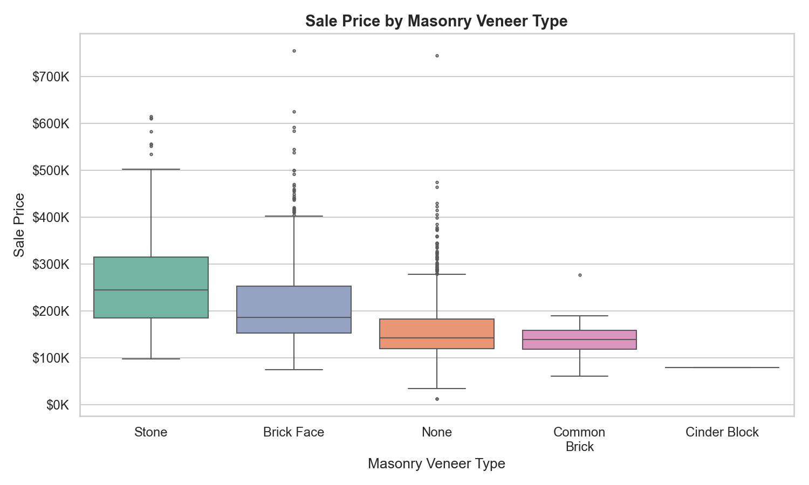
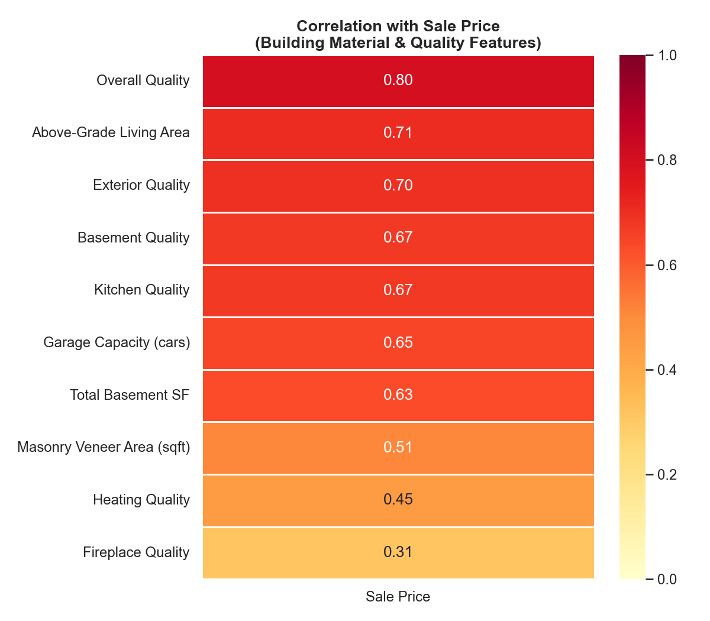

[](https://python.org)
[](https://pandas.pydata.org)
[](https://matplotlib.org)
[](https://seaborn.pydata.org)
[](https://numpy.org)
[]()
[](report.html)

# Building Materials & Home Features: Impact on Property Values
> **[View Interactive Report](https://htmlpreview.github.io/?https://raw.githubusercontent.com/Tommy-Nguyen-Stonera/python-housing-features-analysis/main/report.html)** — Full analysis with findings, methodology, and insights


> **Interactive report available:** Open [`report.html`](report.html) for the full analysis with embedded charts, business context, and detailed methodology.

---

## Background & Motivation

After five years selling stone, tiles, and flooring across Sydney, I have developed a gut feel for which materials add value to a property. Conversations with homeowners almost always circle back to the same question: "Will this actually increase what my home is worth?" I have answered that question hundreds of times based on experience and industry knowledge, but I had never tested those instincts against hard data.

This project let me do exactly that. I took the Ames Housing dataset -- 2,930 residential property sales with 82 features covering everything from exterior cladding to kitchen quality -- and ran a structured analysis focused on the materials and finishes I deal with every day. Some of what I found confirmed what I suspected. And some of it genuinely surprised me.

The goal was not just academic. I wanted to build something I could reference in real conversations with clients and contractors. When someone asks whether upgrading from vinyl siding to cement board is worth the cost, I want an answer backed by data, not just a hunch.

## Business Questions

This analysis is structured around six questions that come up repeatedly in my work:

1. **Which exterior cladding materials are associated with the highest property values?** If a homeowner is choosing between vinyl, brick, or cement board, what does the data say about the price difference?
2. **How much does overall build quality actually matter?** Is the relationship linear, or do the top tiers command a disproportionate premium that justifies premium finishes?
3. **What is the real dollar premium for an excellent kitchen vs. an average one?** Kitchens are where homeowners spend the most on stone benchtops and splashbacks -- does the data support that investment?
4. **Does foundation type predict sale price?** Poured concrete vs. cinder block -- is there a measurable difference, and what does that tell us about buyer perception of structural quality?
5. **How much value does masonry veneer add over no veneer?** Stone and brick face are products I sell regularly -- this question has direct commercial relevance.
6. **Which material and quality features have the strongest overall correlation with price?** Beyond individual comparisons, what does the big picture look like?

## How I Approached This

I started with exterior materials because that is what I sell. The analysis began with a simple question: do properties clad in premium materials sell for more? The answer was yes, but the data pushed me further. Kitchen quality turned out to be an even bigger value driver than I expected, which led me to ask whether the quality of finishes matters more than the type of material itself.

That shift in thinking shaped the rest of the analysis. Instead of just comparing material A vs. material B, I started looking at quality ratings across multiple categories -- exterior, kitchen, basement, heating -- and how they correlate with price. The correlation heatmap (Chart 6) became the most important output because it answered a question I had not originally planned to ask: **what matters most, full stop?**

The answer is clear. Overall quality (r = 0.80) dominates everything else. Above-grade living area (r = 0.71), exterior quality (r = 0.70), and kitchen quality (r = 0.67) follow. Raw square footage and material type matter, but the quality of execution matters more. How you build matters as much as how big you build.

## Key Findings

### 1. Exterior Cladding Material

**Chart:** Box plot comparing sale price distributions across exterior cladding types, ordered by median sale price. Each box shows the interquartile range with whiskers extending to 1.5x IQR. I initially plotted all exterior materials separately, but some (like stone and asbestos shingle) had fewer than 10 observations. The box plots for those materials were visually dramatic but statistically meaningless — one outlier could swing the median by $50K. I set a threshold of 30 observations and grouped everything below that into "Other." This is a trade-off: I lose the ability to comment on rare materials, but I gain confidence that the patterns I report are real.

| Material | Median Sale Price | Count |
|---|---|---|
| Cement Board (Fibre Cement) | $238,000 | 62 |
| Wood Siding | $215,000 | 206 |
| Brick Face | $210,000 | 50 |
| Vinyl Siding | $203,000 | 1,026 |
| Plywood | $152,000 | 221 |
| Hardboard (HdBoard) | $140,000 | 442 |
| Metal Siding | $135,000 | 45 |



**Industry context:** Cement board (fibre cement) topping the list at $238K median makes sense from a construction standpoint. It is durable, fire-resistant, low-maintenance, and increasingly specified by architects for modern builds. In Australia, brands like James Hardie dominate the market and the product carries a premium perception that clearly translates to sale price. The $35K gap over vinyl siding is meaningful -- it suggests buyers (or at least the market) recognise and reward material quality in exterior finishes.

Vinyl siding at $203K median likely reflects its prevalence in newer, mass-market builds. It is cost-effective, clean, and widely accepted. The fact that it sits $63K below cement board is useful context for any homeowner weighing the upgrade.

### 2. Overall Quality Rating

**Chart:** Box plot showing sale price distribution for each quality rating on a 1-10 scale. The colour gradient (yellow to red) visually reinforces the price escalation.



The data here is striking. Each quality point adds roughly **$40,000** to median sale price, but the relationship is not linear -- it accelerates at the top end:

- Quality 5 to 7: +$67,000
- Quality 7 to 9: +$160,000

That acceleration matters. It means the jump from "good" to "excellent" is worth more than double the jump from "below average" to "good." For anyone specifying finishes on a build, this is the argument for going premium on the details that drive quality perception: cabinetry, trim, hardware, stone benchtops. The marginal cost of upgrading finishes from quality 7 to quality 9 is far less than the $160K in additional property value it is associated with.

Overall quality has the **strongest correlation with sale price** in the entire dataset (r = 0.80). Nothing else comes close.

### 3. Kitchen Quality

**Chart:** Dual panel -- left shows box plots of sale price by kitchen quality grade (Fair through Excellent), right shows a bar chart of median sale prices with dollar annotations.



An excellent kitchen commands a **$189,000 premium** over an average kitchen. Even the step from Average to Good adds roughly $50K in median value. Kitchens are not the place to cut corners.

This finding resonates with my experience. Kitchen renovations are where homeowners spend the most on stone benchtops, splashbacks, and premium fixtures. The data validates that spending. A kitchen rated "Excellent" is not just nicer to cook in -- it is associated with nearly $200K more in sale price compared to "Average."

The practical takeaway for clients: invest in quality kitchen finishes (stone benchtops, quality cabinetry, good hardware) because the data shows buyers reward it heavily.

### 4. Foundation Type

**Chart:** Bar chart showing median sale price by foundation type with 95% confidence intervals. Labels have been expanded from abbreviations (PConc = Poured Concrete, CBlock = Cinder Block, etc.) for readability.



**Poured concrete foundations** lead at $208,400 median -- about **$43K above cinder block** ($165K). Slab foundations sit at the bottom, which aligns with them being common in lower-cost, single-storey builds.

This one is less about the foundation itself and more about what it signals. Poured concrete foundations are more expensive to construct, so they tend to appear in higher-spec builds. The $43K premium likely reflects the overall quality of the home rather than buyers specifically valuing the foundation material. Still, for anyone involved in new construction, the data confirms that poured concrete is the standard for premium builds.

This is a textbook confounding variable, and it made me cautious about every other finding. If foundation type is really just a proxy for overall build quality, then how many of my other material comparisons are also proxies? The correlation heatmap was partly motivated by this question — I wanted to see which features had independent predictive power versus which were just riding along with overall quality.

### 5. Masonry Veneer Type

**Chart:** Box plot comparing sale price distributions across masonry veneer types (Stone, Brick Face, Common Brick, None, Cinder Block), ordered by median sale price.



- **Stone veneer: $245,000 median** vs. no veneer at $143,000 -- a **$102K difference**
- Brick face veneer also commands a premium ($205K median)

This is one of the most commercially relevant findings in the analysis. Stone veneer is a product I sell, and the data shows a $102K median price difference between properties with stone veneer and those with no veneer at all. Obviously, correlation is not causation -- homes with stone veneer tend to be higher-spec builds overall. But the association is strong, and it gives me a data point I can reference in client conversations.

The practical reality is that stone veneer is one of the more accessible exterior upgrades. The material and installation cost is a fraction of the $102K price differential, which makes it one of the highest-ROI improvements a homeowner can consider.

### 6. Feature Correlation Heatmap

**Chart:** Heatmap showing Pearson correlation coefficients between building material/quality features and sale price. Values range from 0 to 1, with warmer colours indicating stronger positive correlation. Features are sorted by correlation strength.



| Feature | Correlation (r) |
|---|---|
| Overall Quality | 0.80 |
| Above-Grade Living Area | 0.71 |
| Exterior Quality | 0.70 |
| Basement Quality | 0.68 |
| Kitchen Quality | 0.67 |
| Garage Capacity | 0.65 |
| Total Basement SF | 0.63 |
| Masonry Veneer Area | 0.51 |
| Heating Quality | 0.50 |
| Fireplace Quality | 0.47 |

Quality ratings consistently outperform raw square footage in predicting price. The top five correlates include four quality measures and only one area measure. **How you build matters as much as how big you build.**

## What Surprised Me

- **Kitchen quality outweighs exterior material.** I expected exterior cladding to be the strongest material-related predictor, but kitchen quality (r = 0.67) beats every individual exterior material comparison. The interior finish quality drives more value than the facade.

- **The quality curve accelerates, it does not flatten.** I assumed diminishing returns at the top end -- that going from quality 8 to 9 would add less than going from 5 to 6. The opposite is true. Premium finishes compound in value. The market pays disproportionately more for excellence — which challenges the conventional wisdom I hear from builders every week: "Don't over-capitalise." The data suggests the market actually rewards what builders call over-capitalisation at the premium end — or at least, what they call over-capitalisation is not over-capitalisation at all.

- **Masonry veneer area correlates at 0.51.** I expected it to be lower. The fact that the sheer amount of stone or brick on a property has a moderate correlation with price -- independent of other quality factors -- suggests that veneer is not just a cosmetic detail. It signals build quality to buyers.

- **Heating quality (r = 0.50) is surprisingly relevant.** I would not have guessed that HVAC quality correlates as strongly as masonry veneer area. It is a reminder that buyers (or appraisers) pay attention to systems, not just surfaces. It raises the question of whether buyers are explicitly evaluating HVAC systems during inspections, or whether heating quality is another proxy for overall build standard. If it is the former, there is a marketing angle for HVAC suppliers that I had not considered.

## What I Would Investigate Next

- **Interaction effects:** Does premium exterior cladding matter more on a high-quality build than a low-quality one? I suspect the value of cement board is amplified when paired with excellent kitchen and exterior quality ratings.

- **Cost-to-value ratios:** Pairing this data with material cost data would let me calculate actual ROI for each upgrade. Stone veneer is associated with $102K more in price, but what does it cost to install? That ratio is what clients actually need.

- **Geographic variation:** This dataset is from Ames, Iowa. I work in Sydney. Running the same analysis on Australian property data would test whether these patterns hold across markets, or whether material preferences are regional.

- **Time trends:** The dataset spans multiple years. Do material premiums change over time? Has cement board always been the top exterior material, or is it a recent trend?

- **Multivariate modelling:** This analysis is mostly bivariate. Building a regression model with interaction terms would let me isolate the independent contribution of each material and quality feature, controlling for confounders like lot size and location.

## Dataset

- **Source:** Ames Housing dataset (Dean De Cock, 2011)
- **Records:** 2,930 residential property sales
- **Features:** 82 variables covering lot characteristics, building materials, quality ratings, room counts, garage details, and sale conditions
- **Location:** Ames, Iowa, USA
- **Price range:** $12,789 to $755,000 (median $163,000)

## Tech Stack

| Tool | Purpose |
|---|---|
| Python 3.12 | Core language |
| Pandas 2.2 | Data manipulation, aggregation, groupby analysis |
| Matplotlib 3.9 | Chart rendering and customisation |
| Seaborn 0.13 | Statistical visualisation (box plots, heatmaps) |
| NumPy 1.26 | Numerical operations and correlation computation |

## Project Structure

```
python-housing-features-analysis/
  ames_housing.tsv          # Raw dataset (2930 rows, 82 columns)
  analysis.py               # Full analysis script (generates all charts)
  report.html               # Interactive HTML report with embedded charts
  README.md                 # This file
  visuals/
    01_exterior_material_vs_price.png
    02_overall_quality_vs_price.png
    03_kitchen_quality_vs_price.png
    04_foundation_vs_price.png
    05_masonry_veneer_vs_price.png
    06_feature_correlation_heatmap.png
```

## How to Run

```bash
# Clone the repository
git clone https://github.com/Tommy-Nguyen-Stonera/python-housing-features-analysis.git
cd python-housing-features-analysis

# Install dependencies
pip install pandas matplotlib seaborn numpy

# Run the analysis (generates all charts in visuals/)
python analysis.py
```

## AI Tools Disclosure

I used AI coding assistants for debugging and code suggestions. The analysis approach, business questions, and all interpretations are my own work, informed by five years of experience in the building materials industry.

---

**Tommy Nguyen** | [GitHub](https://github.com/Tommy-Nguyen-Stonera) | [Portfolio](https://tommy-nguyen-stonera.vercel.app)
